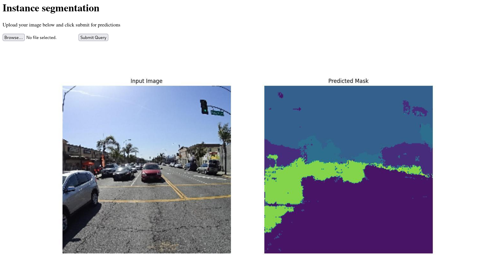

# Instance segmentation via transfer learning 



There are 3 notebooks:
1. `sampleDataset` is how the dataset was sampled
2. `train` where it is shown how the model was fine-tuned and trained
3. `evaluate` provides code for evaluating the model

All of them are self-explanatory.

Inference is available via REST API, made using a simple *Flask* app. Run with:
```shell
python app.py
```

## Environment set-up
```shell
python3.8 -m venv venv
source venv/bin/activate
pip install git+https://github.com/tensorflow/examples.git
pip install -r requirements.txt
```

## Data-set
[Mappilary Vistas](https://openaccess.thecvf.com/content_ICCV_2017/papers/Neuhold_The_Mapillary_Vistas_ICCV_2017_paper.pdf) v1.2, which contains 25 000 fully-annotated high-resolution images with 66 object categories.

## Base model
[pix2pix](https://www.tensorflow.org/tutorials/generative/pix2pix) : Image-to-image translation with a conditional GAN.
